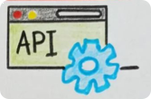
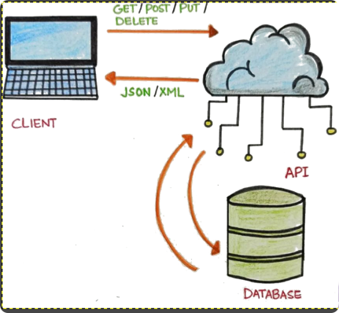
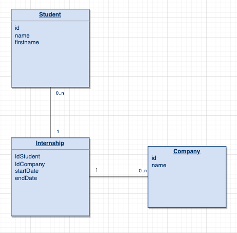
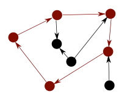
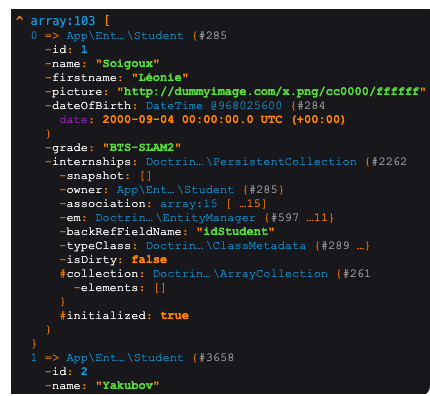

# API Gestion de stage des étudiants



Un projet de découverte de Symfony pour la création d'une API.

# Documentation API
https://documenter.getpostman.com/view/2209621/2s93JwP2cv

# API




***

# Initialisation du projet
:
> Requis:
> Vous devez avoir le module **sqlite3** d'activé sur votre installation PHP.
> Pour vérifier: `php -m`

## Installation from scratch 

Installation de Symfony en version minimale (aucune dépendance, il faudra **tout** installer manuellement)

```bash
symfony new API-Gestion-Stages-Etudiants --version="5.4"
```

### Liste des dépendances à ajouter

Via composer, vous allez ajouter les dépendances suivantes, elles seront utiles ultérieurement.

```bash
# Uniquement en environnement de dev, un bundle facilitant la création d'éléments dans Symfony
composer require symfony/maker-bundle --dev

# Si vous utilisez un serveur Apache
composer require symfony/apache-pack

# Pour la base de données
composer require doctrine/annotations
composer require orm

# Pour sérialiser et normaliser les données
composer require symfony/serializer-pack
```

## Clonage du projet

Récupérez le projet depouis GitHub.

```bash
git clone git@github.com:LiliwoL/Symfony-API-Gestion-Stages-Etudiants.git
cd Symfony-API-Gestion-Stages-Etudiants
```

### Installation des dépendances

Dans le fichier **composer.json**, toutes les dépendances nécessaires sont listées.
Installez-les avec la commande :
```bash
composer install
```

***

# Configuration

Comme dans tous les projets Symfony, la configuration se fait dans un fichier d'environnement.
Créez le fichier **.env** dans lequel on va spécifier un secret, mais surtout l'emplacement de la base de données sqlite.
Vous pouvez recopier le fichier **.env.sample** comme exemple.

***

# Création des entités

Les entités sont la représentation **objet** des tables qui figureront dans la base de données

## Création

```bash
symfony console make:entity
```

Répondez aux questions.

# Migrations de la structure

On va appliquer à la base de données les déclarations objets.
En résumé, les entités seront transformées en tables dans la base.

```bash
# Génération de fichiers de migration
symfony console make:migration

# Application des migrations dans la base
symfony console doctrine:migration:migrate
```

# Import des données dans Sqlite

Pour ajouter les données dans sqlite, utilisez les fichiers **sql** placés dans le dossier **DATA**.

# Création des Contrôleurs

```bash
symfony console make:controller ApiStudentController
```

***

# Normalisation / Sérialisation

Afin d'afficher sous forme de tableau un objet, on va recourir à la **normalisation**.
Dans le sens inverse, ce sera de la **sérialization**.

Symfony propose des interfaces performantes pour cela.

On utilisera le composant **serializer-pack**.
Il a normalement été installé à la création, ou au clonage du projet.

```bash
composer require symfony/serializer-pack
```

On va renvoyer un objet de la base de données au format JSON

***

# Vérification des routes avec Postman

Lancez votre serveur web Apache ou utilisez le serveur intégré à Symfony.

```bash
symfony serve
```

Avec l'utilitaire **Postman**, ouvrez la collection de requêtes située dans **PostmanRequestsCollection**.

Vérifiez les routes existantes.

***
***
***

# Travail à faire

* Améliorez l'existant (vérification, retirer les commandes de debug **dd**, contenu des réponses)
* Ajouter un contrôleur **Company** sur le même modèle.
* Publiez le résultat dans votre GitHub et fournissez l'url à l'enseignant.
* Générer une documentation de l'API
  * https://github.com/slatedocs/slate
  * https://github.com/nelmio/NelmioApiDocBundle
  * https://swagger.io/solutions/api-documentation/
  * https://readme.com/documentation
  * https://github.com/Mermade/widdershins
  * https://www.postman.com/api-documentation-tool/

# Entité Company

```bash
symfony console make:entity
```

# Ajout de la relation Student / Company

```bash
symfony console make:entity
```

Entité: Internship

Champ: idStudent
Type: relation
RelationType: ManyToOne
Nullable: no
Add a property to Student: yes
New field inside Student: internships
OrphanRemoval: no

Champ: idCompany
Type: relation
RelationType: ManyToOne
Nullable: no
Add a property to Student: yes
New field inside Student: internships
OrphanRemoval: no

Champ: startDate
Type: date

Champ: endDate
Type: date


symfony console make:migration

symfony console d:m:m



On fait ensuite le controller ApiInternshipController avec les actions

* index
* add
> Problème:
> Si on retente les routes pour lister les étudiants
> 
Message **Circular Reference**



Il faut ajouter un contexte au normalizer.


***

# Routes

## Students

### Liste des étudiants

GET /api/student



### Ajour d'un étudiant

POST /api/student

Attention au Header, qui DOIT être en json


Payload à fournir:
```json
{
    "name":"didier",
    "firstname":"favreau",
    "picture": "TEST image vide",
    "date_of_birth": "15-05-1981",
    "grade": "PROF"
}
```

# Génération d'une documentation d'API

# Sécurisation d'une API

https://openclassrooms.com/fr/courses/7709361-construisez-une-api-rest-avec-symfony/7795148-authentifiez-et-autorisez-les-utilisateurs-de-l-api-avec-jwt
https://dev.to/loopdelicious/using-jwt-to-authenticate-and-authorize-requests-in-postman-3a5h
https://jwt.io/introduction